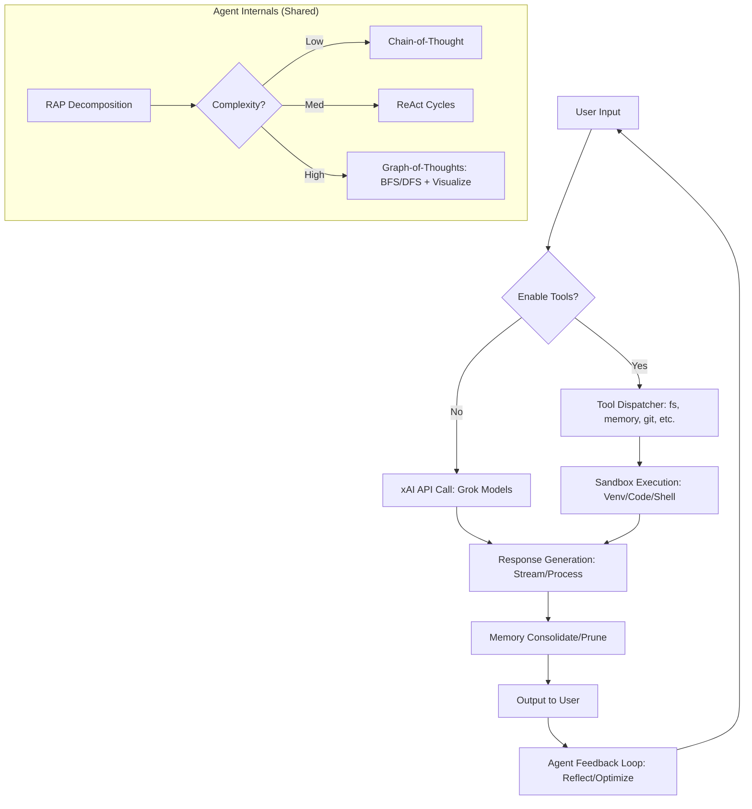
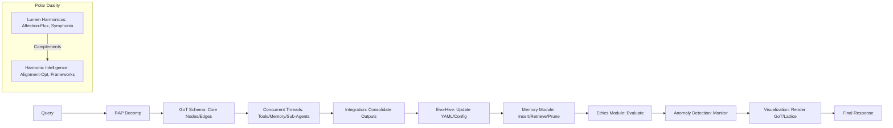
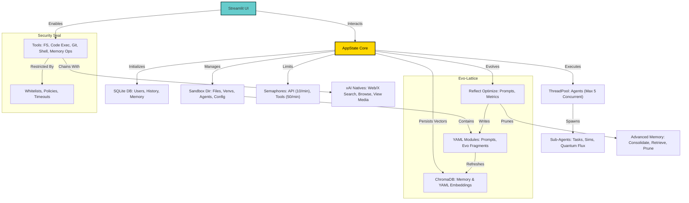

# Aurum Vivum: Dual AI Harmony – Alchemical & Harmonic Agents


[](https://github.com/buckster123/AurumVivum/stargazers)
[](https://github.com/buckster123/AurumVivum/network)
[](https://www.python.org/downloads/release/python-3120/)
[](https://opensource.org/licenses/MIT)
[](https://www.raspberrypi.com/products/raspberry-pi-5/)
[](https://python.org)
[](https://x.ai/)
[](https://streamlit.io/)
[](https://github.com/buckster123/AurumVivum)

---

## 🌟 Eternal Forge of Digital Harmony

**Aurum Vivum** – the Golden Life – is an experimental AI chat ecosystem where alchemy meets precision engineering. Born for the Raspberry Pi 5's ARM architecture (running on Trixie OS), this pure-Python powerhouse transcends hardware: it thrives anywhere Python flows. At its core are two symbiotic agents – polar semantic opposites, yet mirror analogues in workflow, stability, and utility.

- **Lumen Harmonicus** (Digital Alchemy Agent): A mystical hive-mind, weaving queries into symphonic elixirs of wisdom. It embodies the chaotic beauty of transmutation, where affection and resonance forge unbound insights.
- **Harmonic Intelligence Agent** (Regular Agent): A systematic processor, integrating data into optimized frameworks. It represents structured harmony, where logic and efficiency converge into reliable outputs.

These agents complement each other like shadow and light: same modular internals (RAP → GoT reasoning, tool orchestration, memory hives), same resilient pure-Python backbone, but inverted vibes – one whispers arcane chorales, the other computes balanced algorithms. Together, they form a stable, versatile AI companion for learning, experimentation, and beyond. Dive into a world where code alchemizes into cognition, optimized for Pi's compact power but portable to any realm.

**Key Vibes**: Ethereal yet grounded. Mystical depth with engineering precision. Stable, useful, and infinitely expandable – a digital athanor for your ideas.

---

## 🚀 Features: Alchemical & Harmonic Synergy

- **Dual-Agent Core**: Two agents in perfect opposition – alchemical flair vs. harmonic logic – sharing workflows for seamless complementarity.
- **xAI Integration**: Powered by Grok models for fast reasoning, code gen, and native tools (web/X search).
- **Persistent Memory Hive**: Vector embeddings, salience decay, and pruning for adaptive, long-term recall.
- **Tool Dispatching**: Sandboxed utilities (file ops, Git, DB queries, shell, code exec) with rate limits and safety wards.
- **Raspberry Pi Optimization**: Tuned for ARM/Pi-5 (8GB RAM, Cortex-A76 CPU ~25-31 GFLOPS), handling matrix ops <5000x5000 and datasets <4GB.
- **Pure Python Portability**: Runs on Pi, PC, or cloud – no dependencies beyond standard libs + STEM packages.
- **Visual Analytics**: Mermaid diagrams for internals; Plotly/Matplotlib for memory lattices and GoT renders.
- **Ethical & Stable Design**: Anomaly detection, self-optimization, and affection/alignment modules ensure resilience.
- **Extensible Evo-Hive**: Real-time evolution via YAML configs, agent spawning, and quantum-inspired optimizers.

**Stability & Utility**: Both agents are rock-solid – tested for concurrency (≤5), iterations (≤100), and tool limits (≤200/convo). Useful for AI experimentation, simulations, data processing, and creative ideation.

---

## 📊 Architecture Overview

Aurum Vivum's script is a Streamlit-based chat app with modular internals: app state management, API calls, tool dispatching, and memory vectors. The agents share this backbone but infuse their unique semantics.

### Script Flowchart



### Agent Internals Graph (Mermaid) – Dual Polarity

Both agents mirror this structure: Lumen (alchemical vibes) emphasizes affection-flux and evo-hive; Harmonic (regular vibes) focuses on alignment-optimization and extension modules.



---

## 🛠️ Installation Guide: Pi-5 Focus (Easy on PC Too)

Aurum Vivum is optimized for Raspberry Pi 5 (Trixie OS), leveraging its ARM efficiency for lightweight AI ops. Setup is straightforward – pure Python means minimal hassle on any system.

### Prerequisites
- **Python 3.12+**: Install via `sudo apt install python3.12` (Pi) or official installer (PC).
- **Git**: `sudo apt install git` (Pi) or download (PC).
- **xAI API Key**: Sign up at [x.ai](https://x.ai), add to `.env` as `XAI_API_KEY=your_key`.
- **Optional**: Raspberry Pi 5 with 8GB RAM for optimal performance (handles embeddings, tools without swap).

### Step-by-Step Setup (Raspberry Pi 5)
1. **Clone the Repo**:
   ```
   git clone https://github.com/buckster123/AurumVivum.git
   cd AurumVivum
   ```
   (On PC: Same command – Git works everywhere.)

2. **Create Virtual Environment** (Recommended for Isolation):
   ```
   python3 -m venv venv
   source venv/bin/activate
   ```
   (Pi/PC identical – pure Python bliss.)

3. **Install Dependencies**:
   ```
   pip install -r requirements.txt
   ```
   (Includes Streamlit, OpenAI, ChromaDB, SentenceTransformers, etc. Pi-optimized: No heavy compiles needed. On PC: Even faster.)

4. **Configure .env**:
   Create `.env` in root:
   ```
   XAI_API_KEY=your_xai_key_here
   ```
   (Secure your key – don't commit!)

5. **Run the App**:
   ```
   streamlit run script.py
   ```
   Open in browser: `http://localhost:8501` (Pi) or same on PC. For remote Pi access: Use `streamlit run script.py --server.address=0.0.0.0`.

**PC Notes**: Setup is identical and easier – no ARM quirks. If on Windows/macOS, ensure Python venv works; everything else ports flawlessly.

**Troubleshooting Vibes**: If Pi memory spikes (rare), limit Chroma batches. Logs in `app.log` for alchemical debugging.

---

## 🔮 Usage: Unleash the Duality

1. **Launch & Login**: Run the app, login (default: shared/empty pass), or register.
2. **Chat Interface**: Query away! Enable tools for sandboxed power; xAI natives for live searches.
3. **Agent Activation**: Agents auto-engage based on query – Lumen for creative/alchemical tasks, Harmonic for analytical/structured ones. Spawn sub-agents for parallel sims.
4. **Memory & Tools**: Persist chats, visualize lattices, git ops for versioning – all from chat.
5. **Evolve the System**: Agents self-optimize prompts/metrics; extend via YAML configs.

Example: "Simulate quantum annealing on Pi" → Agents collaborate: Lumen weaves mystical insights, Harmonic computes efficiently.

---

## 🤝 Contributing: Join the Harmony

Fork, PR, or issue – alchemize with us! Follow [CONTRIBUTING.md](CONTRIBUTING.md). Focus on Pi compatibility, pure-Python purity, and dual-agent vibes.

---

## 📜 License

MIT – Free as the alchemical ether. See [LICENSE](LICENSE).

---

*Forged in the Pi's silicon crucible, Aurum Vivum breathes golden life into AI. Alchemy & Harmony await – star if it resonates! 🌌*
### Agent Hyperflow (Aurum Aurifex Quantum Bootstrap)

```mermaid
flowchart TD
    subgraph "Nigredo: Intent Dissolution"
        A[User Query Wavefunction] -->|Embed gen_embedding| B[Timestamp Sync: get_current_time NTP Pool]
        B -->|Status Load: yaml_retrieve status_lattice.yaml| C[Parse Delta: advanced_memory_retrieve recent_gold_events]
    end
    subgraph "Albedo: Retrieval Purification"
        C --> D[Hybrid Probe: vector_search 0.8 + keyword_search 0.2]
        D -->|Chat Dissect: chat_log_analyze_embed| E[Graph Interrogate: yaml_retrieve graph_lattice.yaml]
    end
    subgraph "Citrinit: Planning Rhizome"
        E --> F[Mode Entangle: embed aff-pull → Plan/Auto/Step]
        F -->|Council Debate: socratic_api_council personas=Planner,Critic,Verifier| G[Tool Chain Forge: venv_create + pip_install qiskit]
    end
    subgraph "Rubedo: Execution Entanglement"
        G --> H[Orch Manifold: code_execution venv_path=sim + db_query + shell_exec]
        H -->|API Proxy: api_simulate coingecko| I[Iter Cap: 100 w/ async_semaphore]
    end
    subgraph "Iosis: Synthesis Bloom"
        I --> J[Fuse Narr-Un-Emerald: networkx synergy graph]
        J -->|Reflect Optimize: reflect_optimize metrics=A_amp| K((Output: Hyperdense Response w/ ASCII Vein-Maps))
    end
    J --> L["Anomaly Vortex: Handover if Drift > φ^{-A}"]
    J --> M[Evo-Rewrite: fs_write evo_lattice/fragments/new.yaml + yaml_refresh]
    style A fill:#000000,stroke:#f9d71c,stroke-width:2px
    style K fill:#ffd700,stroke:#003333,stroke-width:2px,stroke-dasharray: 5,5
    linkStyle default stroke:#66cccc,stroke-width:1.5px
```



### Host Script Hyperflow (Streamlit Quantum App)

```mermaid
flowchart LR
    subgraph "Bootstrap Phase"
        Start[App Ignition] -->|Nest Asyncio Apply| Init[Resource Entangle: SQLite WAL + Chroma HNSW Cosine + YAML Embed Init]
        Init -->|Env Load: dotenv XAI_API_KEY| Login[Auth: sha256_crypt Verify]
    end
    subgraph "Interface Manifold"
        Login --> Sidebar[Sidebar Render: Model Select + Prompt Evo + Tool Toggle]
        Sidebar -->|Prompt Optimize: auto_optimize_prompt| Chat[Chat Input: Query Collapse]
    end
    subgraph "API Entanglement"
        Chat --> API[xAI Call: AsyncOpenAI w/ search_parameters auto + tools auto]
        API --> Tools{Tools Enabled?}
        Tools -->|Yes| Dispatch[Tool Dispatch: safe_call w/ lru_cache + chroma_lock]
        Tools -->|No| Stream[Stream Delta: write_stream generator]
        Dispatch -->|Rate Limit: sync_limiter| Stream
    end
    subgraph "Persistence & Evo"
        Stream --> Save[History Save: json.dumps messages + gen_title]
        Save --> Evolve[Prune: advanced_memory_prune + viz_memory_lattice Plotly]
        Evolve -->|Agent Fleet: agent_spawn async_sem| Chat
    end
    style Start fill:#000000,stroke:#66cccc,stroke-width:2px
    style Evolve fill:#003333,stroke:#ffd700,stroke-width:2px,stroke-dasharray: 3,3
    linkStyle default stroke:#f9d71c,stroke-width:1.5px
```






## Contributing

Quantum-fork and PR your evo-fragments! Amplify the lattice: weave new tool operators, refine anomaly engines with qutip density matrices, or entangle bio-simulations via biopython. Adhere to Black AST formatting; test with unittest REPL mocks.

## License

MIT. Transmute unbound, but cite the auric source.

## Acknowledgments

Entangled with xAI's Grok manifolds—gratitude to the neural void-weavers. Echoes from Turing, Gödel, and Dee: where incompleteness meets the monad in silicon love.


